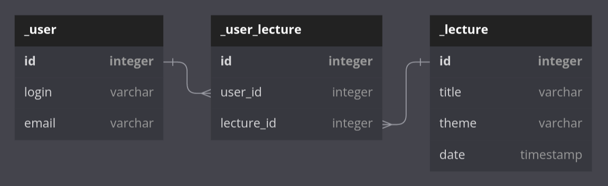

# ConferenceBackend

## Opis projektu

ConferenceBackend to backend strony do obsługi konferencji IT. Dane zapisywane są do bazy danych H2, a dostęp do wszystkich usług realizowany jest za pomocą REST api. Aplikacja powstała w języku Java przy użyciu framework'ów Spring Boot oraz Hibernate. Oto schemat bazy danych:

## Wymagania
- [Java 17](https://www.oracle.com/java/technologies/downloads/#java17)
- [Maven 3](https://maven.apache.org)

## Uruchomienie aplikacji

1. Sklonuj repozytorium:
  <pre>git clone <i>https://github.com/jbiesek/ContentBasedRecommender.git</i></pre>
2. Otwórz projekt za pomocą IDE (najlepiej Intellij)
3. Otwórz plik <i>pom.xml</i> i wykonaj:
  <pre> mvn clean install </pre>
4. Uruchom projekt za pomocą IDE
5. Aby dostać się do konsoli bazy danych H2 otwórz przeglądarkę internetową i wejdź na adres:
[localhost:8080/h2-console](http://localhost:8080/h2-console)    
Jako JDBC URL wpisz: <pre>jdbc:h2:mem:conferencedb</pre>
Jako User Name wpisz: <pre>sa </pre> 
Jako Password wpisz: <pre>password</pre>

## Opis REST pointów

#### Wypełnienie bazy danych przykładowymi danymi
<pre>POST localhost:8080/api/generateModel</pre>  

#### Wyświetlenie wszystkich użytkowników
<pre>GET localhost:8080/api/users</pre>

#### Wyświetlenie użytkownika po numerze id
<pre>GET localhost:8080/api/user/{id}</pre>

#### Rejestracja użytkownika
<pre>POST localhost:8080/api/user/register</pre>
Body:  
{  
&emsp;"login": "Jan",  
&emsp;"email": "jan_kowalski@gmail.com"  
}  
W przypadku poprawnego zarejestrowania system zwraca status 201 Created wraz z wiadomością:  
<pre>Pomyśnie zarejestrowano.</pre>
W razie niepowodzenia system zwraca status 403 Forbidden wraz z jedną z możliwych wiadomości:
<pre>Podano nieprawidłowe dane.</pre>
<pre>W bazie istnieje użytkownik o podanym loginie i e-mailu.</pre>
<pre>Podany e-mail jest już zajęty.</pre>
<pre>Podany login jest już zajęty.</pre>
<pre>Podano nieprawidłowy adres e-mail.</pre>

#### Zmiana adresu e-mail użytkownika
<pre>POST localhost:8080/api/user/updateEmail</pre>
Body:  
{  
&emsp;"login": "Jan",  
&emsp;"email": "'jan_kowalski@gmail.com'",  
&emsp;"updatedEmail": "jan_kowalski1@gmail.com"  
}  
W przypadku poprawnej zmiany adresu e-mail system zwraca status 200 OK wraz z wiadomością:  
<pre>Pomyślnie zmieniono adres e-mail.</pre>
W razie niepowodzenia system zwraca status 403 Forbidden wraz z jedną z możliwych wiadomości:
<pre>Podany e-mail jest już zajęty.</pre>
<pre>Nowy e-mail nie może być taki sam jak stary e-mail.</pre>
<pre>Podano nieprawidłowy adres e-mail.</pre>
<pre>Użytkownik o podanym loginie i e-mailu nie istnieje.</pre>
<pre>Użytkownik o podanym e-mailu nie istnieje.</pre>  
<pre>Użytkownik o podanym loginie nie istnieje.</pre>

#### Edycja użytkownika po numerze id
<pre>POST localhost:8080/api/user/{id}</pre>
Body:  
{  
&emsp;"login" : "Jan1",  
&emsp;"email" : "jan_kowalski1@gmail.com"  
}

#### Usunięcie istniejącego użytkownika po numerze id
<pre>DELETE localhost:8080/api/user/{id}</pre>

#### Wyświetlenie wszystkich prelekcji posortowanych po dacie
<pre>GET localhost:8080/api/lectures/sortByDate</pre>

#### Wyświetlenie wszystkich prelekcji posortowanych po ścieżce tematycznej
<pre>GET localhost:8080/api/lectures/sortByTheme</pre>

#### Wyświetlenie prelekcji po numerze id
<pre>GET localhost:8080/api/lecture/{id}</pre>

#### Wyświetlenie wszystkich prelekcji danego użytkownika po podaniu loginu
<pre>GET localhost:8080/api/lectures/byLogin</pre>
Body:  
Jan

#### Dodanie nowej prelekcji
<pre>POST localhost:8080/api/lecture</pre>
Body:  
{  
&emsp;"title": "Podstawy Spring Boota",  
&emsp;"theme": "Backend",   
&emsp;"date": "2023-06-01T10:00:00+02:00"   
}

#### Edycja istniejącej prelekcji po numerze id
<pre>PUT localhost:8080/api/lecture/{id}</pre>
Body:  
{  
&emsp;"title": "Podstawy Spring Boota 2",  
&emsp;"theme": "Backend 2",   
&emsp;"date": "2023-06-01T10:00:00+02:00"   
}

#### Usunięcie prelekcji po numerze id
<pre>DELETE localhost:8080/api/lecture/{id}</pre>

#### Zapis użytkownika na prelekcję po numerze id po podaniu loginu i hasła
<pre>POST localhost:8080/api/lecture/signIn/{id}</pre>
Body:  
{  
&emsp;"login": "Jan",  
&emsp;"email": "jan_kowalski@gmail.com"  
}  
W przypadku poprawnego zapisu na prelekcję system zwraca status 200 OK wraz z wiadomością:  
<pre>Pomyślnie dokonano zapisu.</pre>
W razie niepowodzenia system zwraca status 403 Forbidden wraz z jedną z możliwych wiadomości:
<pre>Podany użytkownik jest już zapisany na inną prelekcję o tej samej godzinie.</pre>
<pre>Podany użytkownik jest już zapisany na podaną prelekcję.</pre>
<pre>Podany użytkownik nie istnieje.</pre>
<pre>Na podaną prelekcję zapisana jest maksymalna ilość osób.</pre>
<pre>Podana prelekcja nie istnieje.</pre>  
Po zarezerwowaniu miejsca w pliku <i>powiadomienia.txt</i> utworzony zostanie wpis z przykładową wiadomością e-mail do użytkownika.

#### Anulowanie zapisu użytkownika na prelekcję po numerze id po podaniu loginu

<pre>POST localhost:8080/api/lecture/cancelReservation/{id}</pre>
Body:  
Jan  
W przypadku poprawnego anulowania zapisu na prelekcję system zwraca status 200 OK wraz z wiadomością:  
<pre>Pomyślnie anulowano rezerwację.</pre>
W razie niepowodzenia system zwraca status 403 Forbidden wraz z jedną z możliwych wiadomości:
<pre>Podany użytkownik nie zarezerwował miejsca na podanej prelekcji.</pre>
<pre>Podana prelekcja nie istnieje.</pre>
<pre>Podany użytkownik nie istnieje.</pre>

#### Generowanie zestawienia wykładów według zainteresowania

<pre>POST localhost:8080/api/lectures/generateLectureReport</pre>
System zwróci status 200 OK wraz z wiadomością zawierającą zestawienie wykładów według zainteresowania. Raport zostanie również zapisany do pliku <i>raport_prelekcje.txt</i>

#### Generowanie zestawienia ścieżek tematycznych według zainteresowania

<pre>POST localhost:8080/api/lectures/generateThemeReport</pre>
System zwróci status 200 OK wraz z wiadomością zawierającą zestawienie ścieżek tematycznych według zainteresowania. Raport zostanie również zapisany do pliku <i>raport_sciezki_tematyczne.txt</i>
